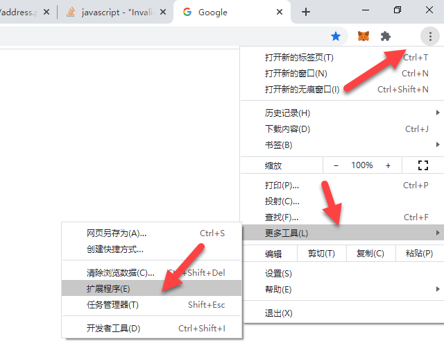
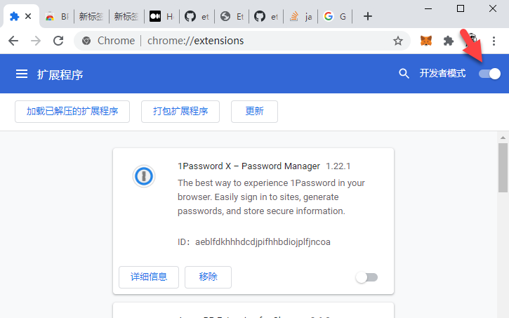
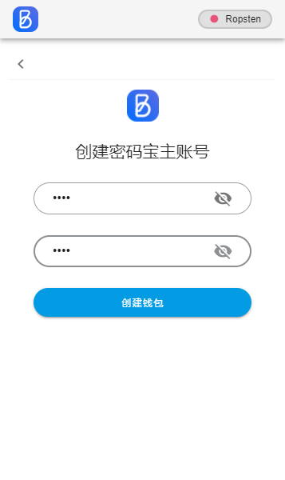
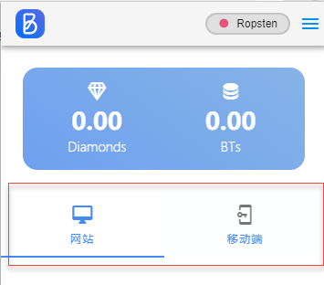
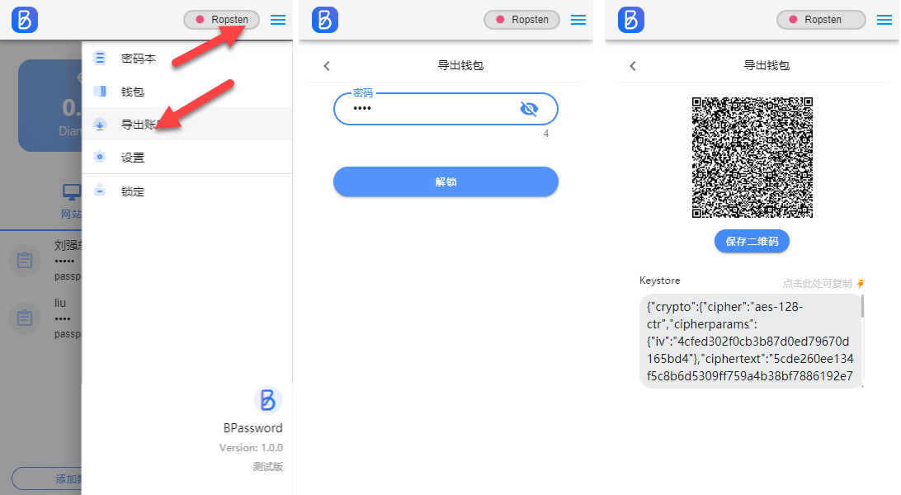
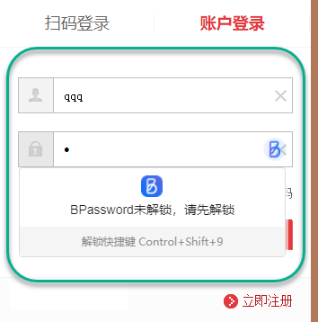

# 用户帮助

## Chrome 本地文件安装

> 通过[Github](https://github.com/lanui/BPassword/releases/tag/v2.0.0)下载安装文件到本地目录.如果下载*.zip 文件先解压得到*.crx.

### 操作步骤

**第一步** : 打开谷歌浏览器,点击右上角 图标,选择 更多工具 --> 扩展程序

**第二步** : 在扩展程序页面 打开”开发者模式”

**第三步** : 将插件压缩包拖入 扩展程序管理页面,安装插件

---

## 插件使用

> 创建账号

- 点击浏览器右上角 BPassword 图标(如没有可通过右上角图标将 BPassword 固定在工具条上)

- 输入密码创建 BPassword 账号

> 添加网站账号信息

BPassword 可管理网站登录账号和移动应用的登录账号信息,这两个功能分别对应首页的网站和移动端 Tab 页.

> > 添加网站登录账号,有两种方式,一种是通过插件首页添加按钮添加,另一种是打开你要登录的网站,在输入框弹出提示页面添加,下面分别介绍:

- 1. 插件首页添加:点击添加数据按钮

**注意** :网站域名要填写登录页的域名,如京东https://passport.jd.com/new/login.aspx?ReturnUrl=https%3A%2F%2Fwww.jd.com%2F 须填写 passport.jd.com 这样在登录京东网站时,BPassword 才会提示 登录选择.(推荐在网站登录页添加,这样可以免去填写域名信息操作)

- 2. 网站登录页方式添加

打开你要管理的网站登录页,如 [京东](https://passport.jd.com/new/login.aspx) ,在登录框内填写用户名和密码, BPassword 就会弹出添加账号信息页面.如下图.

填写提示信息后点击保存,即可将京东登录账号添加到 BPassword 管理.添加完成后,再次打开网站登录时,就会提示账号自动填充.如下图:

> 管理 BPassword 已保存的账号

- 1. 通过 BPassword 插件管理首页查看或修改账号信息(浏览器右上角 BPassword 图标,调出插件)

> 使用 BPassword 管理的账号登录网站

- 打开要登录的网站如: [某电商网站](https://passport.jd.com/new/login.aspx)

如果 BPassword 插件已保存有对应京东的登录账号信息时,点击网站用户吗或密码输入框会提示已保存的账号选择框.选择对应账号自动将账号密码填入网站登录框.

**注意**: 如果网站登录页面的账号和密码均已填有信息,且与 BPassword 管理的账号没有匹配时,不会弹出提示框.
如果你之前已用浏览器自带密码管理功能存储过密码,BPassword 弹出框会被浏览器自带弹出框覆盖.

> 导出 BPassword 主账号信息

- 调出 BPassword 插件(点浏览器右上角 BPassword 图标)
- 点击插件右上角更多功能按钮,选择导出账号
- 输入密码宝主账号密码后进入导出账号页面

> 锁定 BPassword 插件

通过插件锁定菜单,可锁定插件.

锁定后,网站登录提示解锁弹出框

