# 用戶幫助

## Chrome 本地文件安裝

> 通過[Github](https://github.com/lanui/BPassword/releases/tag/v2.0.0)下載安裝文件到本地目錄.如果下載*.zip 文件,請先解壓得到*.crx.

### 操作步驟

**第一步** : 打開谷歌瀏覽器,點擊右上角 圖標,選擇 更多工具 --> 擴展程序

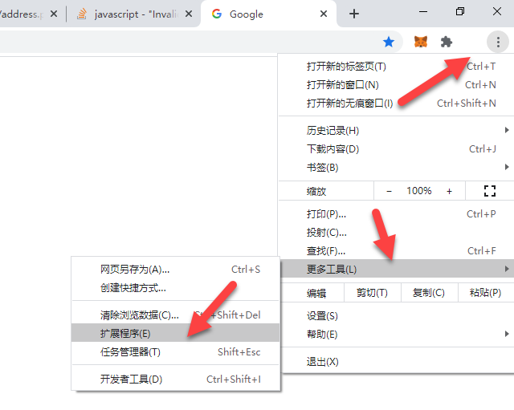

**第二步** : 在擴展程序頁面 開啟”開發這模式”

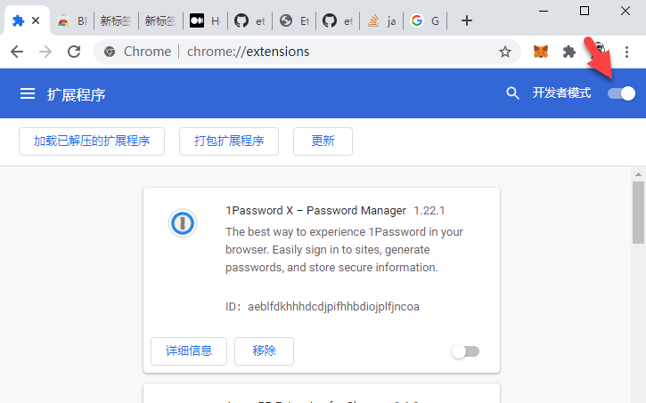

**第三步** : 將插件文件拖入擴展程序管理頁面.

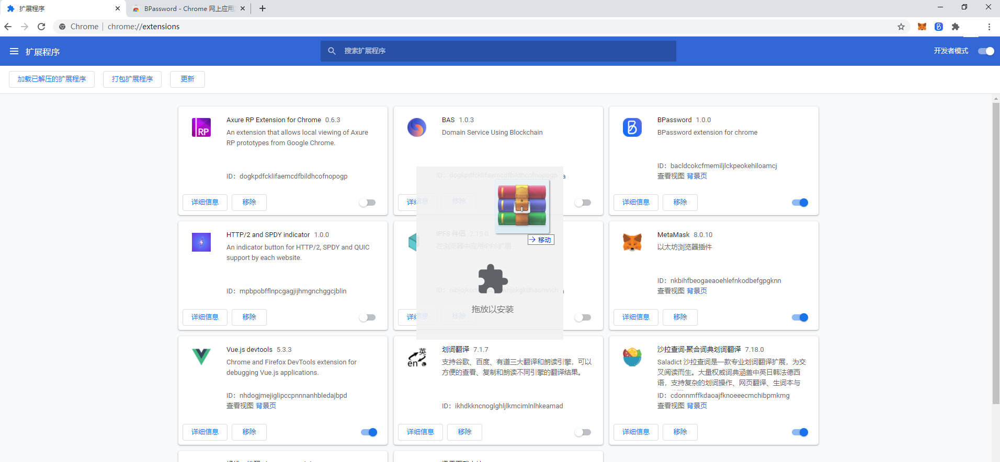

---

## 插件使用

> 創建密碼寶主賬號

- 點擊瀏覽器右上角 BPassword 圖標(如果沒有可通過圖標將 BPassword 固定在工具欄上)

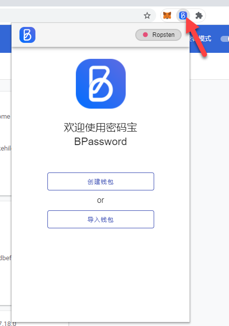

- 輸入密碼創建 BPassword 賬號

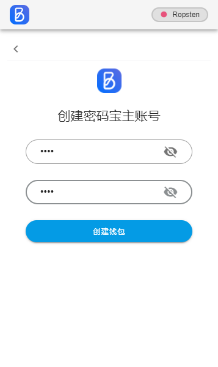

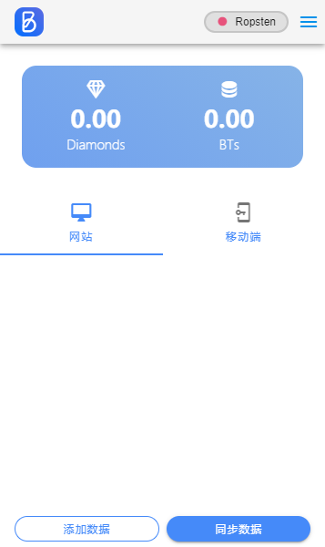

> 添加網站賬號信息

BPassword 可管理網站登錄賬號和移動 APP 賬號兩類信息,可通過首頁 Tab 來切換.

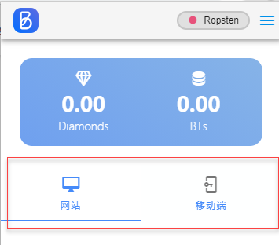

> > 添加网站登录账号,有两种方式,一种是通过插件首页添加按钮添加,另一种是打开你要登录的网站,在输入框弹出提示页面添加,下面分别介绍:

- 1. 插件首頁添加:點擊添加數據按鈕

**注意** :網站域名要填寫登錄頁域名,[蝦皮](https://shopee.tw/buyer/login?next=https%3A%2F%2Fshopee.tw%2F) 需填寫 shopee.tw 這樣下次登錄蝦皮時,BPassword 才會提示登錄賬號選擇.(推薦通過網站頁面方式添加登錄信息)

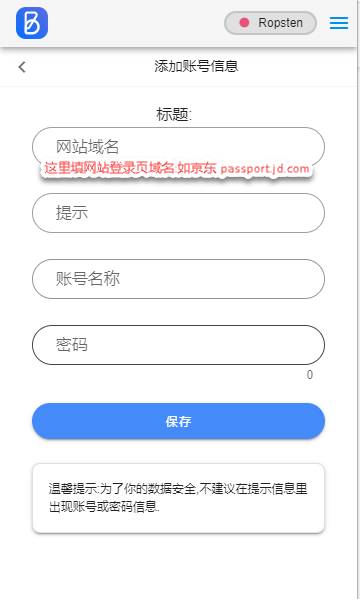

- 2. 網站登錄頁方式添加

打開你要管理的網站登錄頁,如 [蝦皮](https://shopee.tw/buyer/login?next=https%3A%2F%2Fshopee.tw%2F) ,在登錄框內輸入登錄信息,BPassword 就會彈出是否添加到插件保存,如下圖.

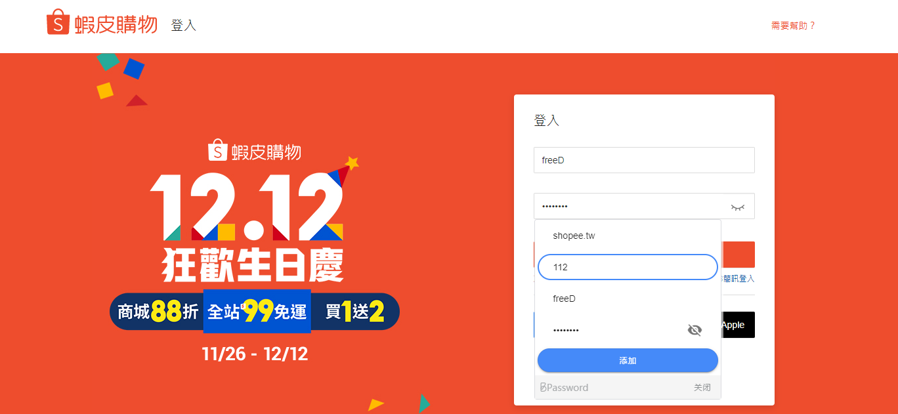

填寫提示信息後點擊保存,BPassword 即可將這個網站的登錄信息以加密方式保存在本地.下次再次登錄網站時就會提示賬號選擇,如下圖:

> 管理 BPassword 已保存的賬號

- 1. 通過 BPassword 插件管理已保存的賬號信息(點擊瀏覽器右上角 BPassword 圖標 或用 Ctrl+Shift+9 快捷鍵,調出插件)

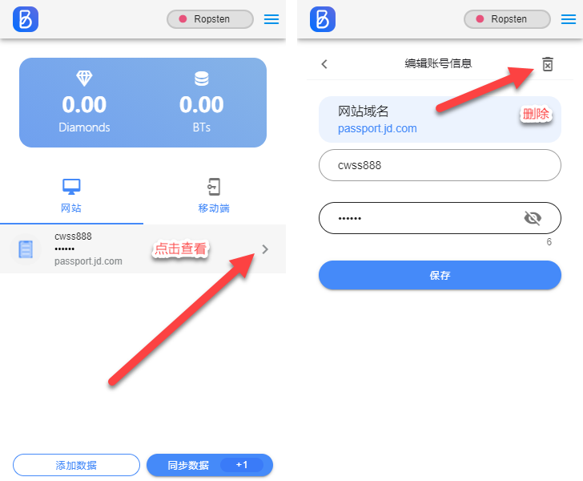

> 使用 BPassword 管理的賬號登錄網站

- 打开要登錄的網站如: [某電商網站](https://shopee.tw/buyer/login?next=https%3A%2F%2Fshopee.tw%2F)

如果 BPassword 插件已保存過網站的登錄賬號信息時,當點擊網站的登錄名或密碼框時,就會彈出賬號選擇提示,選擇要填入的賬號條目,即可回填到網站登錄框.

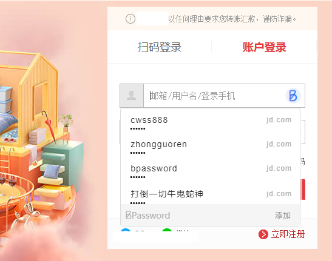

**注意**: 如果網站登錄頁面的賬號和密碼均填有信息,且与 BPassword 管理的賬號沒有匹配時,不會彈出提示框.
如果你之前已用瀏覽器自帶密碼管理功能存儲過密碼,BPassword 弹出框会被浏览器自带弹出框覆盖.

> 導出 BPassword 主賬號信息

- 調出 BPassword 插件(點擊瀏覽器右上角 BPassword 圖標)
- 點擊插件右上角更多功能按鈕,選擇導出賬號
- 輸入密碼寶主账号密碼後進入導出賬號界面

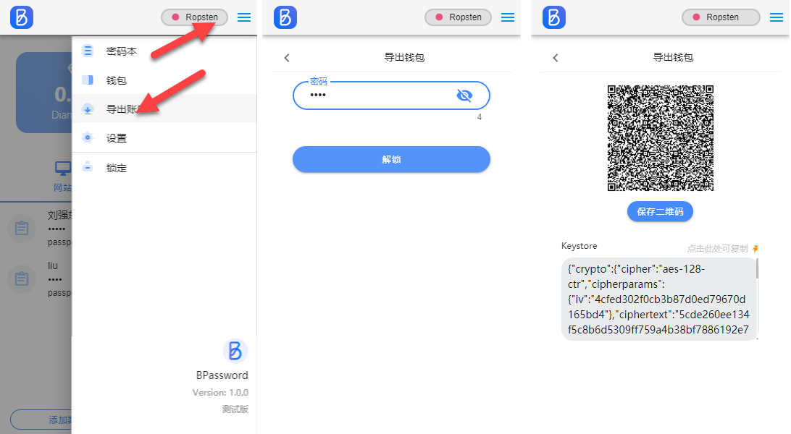

> 鎖定 BPassword 插件

通過插件鎖定菜單,可鎖定插件.

鎖定後,網站登錄提示解鎖弹出框

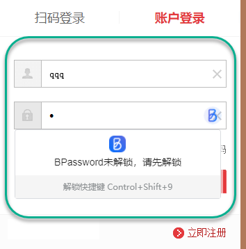
